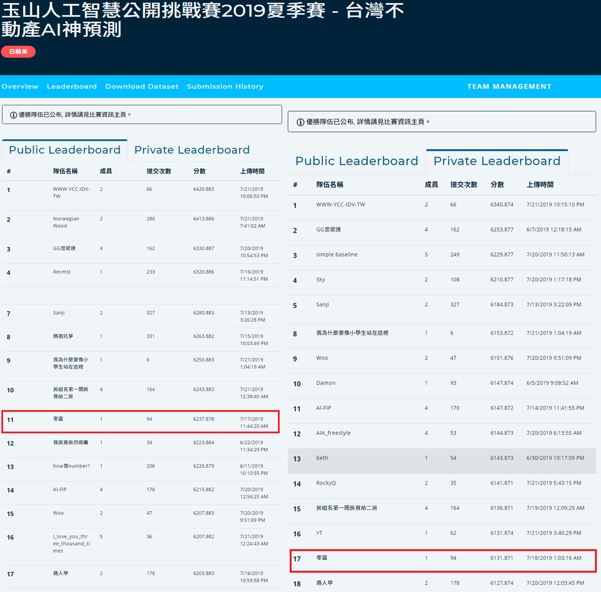

# [TBrain-台灣不動產AI神預測]
This is the top 2% solution for my team "零翼" at the [玉山人工智慧公開挑戰賽2019夏季賽 - 台灣不動產AI神預測](https://tbrain.trendmicro.com.tw/Competitions/Details/6) competition.  

### Task: house price prediction (evaluation: hit score)
The dataset contains 60k rows of training data and 10k rows of testing data. Each row represents the feature vector (dim = 234) of a house, containing attributes such as the number of floors, the area of the building and land, and the location of the building. The house price can range from 2e5 to 3e9, which is challenging for price pridiction. The keys to success are definitely feature engineering and designing appropriate regression techniques. I build a neural network in Keras and ensemble xgboost and lightgbm models as my final submission.

# Requirements:  
- [Keras](https://keras.io/)
- [XGBoost](https://xgboost.readthedocs.io/en/latest/index.html)
- [LightGBM](https://lightgbm.readthedocs.io/en/latest/index.html)
